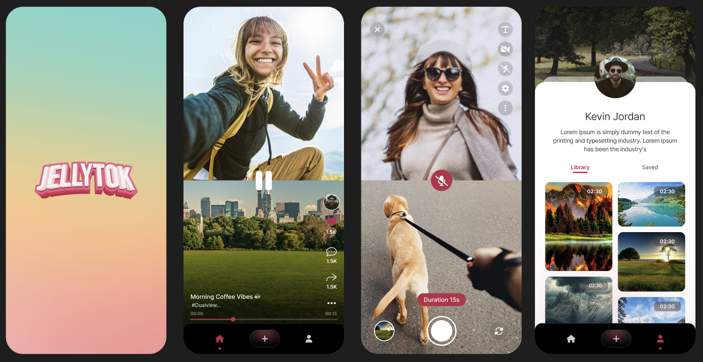

# 📱 JellyTok – iOS Engineering Challenge

<p align="center">
  
</p>

JellyTok is a lightweight iOS app built using SwiftUI for iOS 16+, designed for the Jelly iOS Engineering Challenge. It captures creativity, technical capability, and product thinking across a three-tab interface.

## ✨ Features

### Tab 1 – Feed
- TikTok-style scrollable video feed.
- Fetches videos from a custom API with local fallback.
- Smooth UX with autoplay, interactive overlays, and optimized video playback.
- **Optimizations Implemented:**
    - **Single Reusable `AVPlayer`:** Utilizes one `AVPlayer` instance for the entire feed, significantly reducing resource overhead.
    - **Dynamic `AVPlayerItem` Swapping:** Efficiently changes video content by replacing player items instead of recreating players.
    - **`AVPlayerItem` Caching:** Caches player items to avoid redundant loading from URLs, speeding up video transitions.
    - **Centralized Playback Logic:** `FeedViewModel` manages all playback states, ensuring consistent behavior.
    - **State Synchronization:** Uses `@Published` and `@Binding` for seamless UI updates reflecting player state.
    - **Asynchronous Preloading:** Proactively loads the next video item in the background for smoother scrolling.
    - **Lifecycle Management:** Handles playback resumption and pausing based on the feed's visibility.

### Tab 2 – Dual POV Camera
- Split-screen view using both front and back cameras.
- 15-second synchronized dual video recording.
- Saves videos locally using `FileManager` (with potential for advanced cropping/stitching).
- Navigates to Camera Roll on completion.

### Tab 3 – Camera Roll
- Displays all recorded videos in a grid.
- Supports inline and full-screen playback.
- Neatly organized and accessible from local storage.

---

## 🧱 Tech Stack

- **Language**: Swift
- **Framework**: SwiftUI
- **Platform**: iOS 16+
- **Media**: AVFoundation
- **Storage**: FileManager (local storage)
- **Networking**: URLSession (custom API)
- **Architecture**: MVVM (feature-based folder structure)

> ❌ No third-party libraries or SDKs used.

---

## 🛠 Project Structure

The project is organized by feature folders to support scalability and clarity:

- **Assets.xcassets/**
  - AccentColor.colorset  
  - AppIcon.appiconset  
  - `cover.png` (Ensure this image is added here for the header)
  - … (other assets)

- **CameraRollTab/**
  - `CameraRollView.swift` – UI for video grid/list  
  - `CameraRollViewModel.swift` – Handles video fetching logic  
  - `FullscreenPlayerView.swift` – Fullscreen playback  
  - `InlineVideoView.swift` – Inline player inside grid  
  - `ProfileHeaderView.swift` – Profile section (optional)  
  - `StaggeredGridView.swift` – Custom staggered grid layout  

- **CameraTab/**
  - `CameraView.swift` – (Likely the `UIViewRepresentable` for camera preview)
  - `DualCameraManager.swift` – Handles front & back camera sessions  
  - `DualCameraView.swift` – UI for split-screen camera layout and recording  

- **Components/**
  - `CustomTabBar.swift` – Custom tab bar UI  
  - `VideoPlayerView.swift` – (Potentially a generic reusable video player component, distinct from Feed's specific setup)
  - `DevelopmentModal.swift` - (If you have this as a separate component)

- **ContentView.swift** – Handles tab navigation using `CustomTabBar`  

- **Extensions/**
  - `Bundle+Decodable.swift` – (Or your `Bundle+.swift` for JSON decoding)
  - `Color+.swift` – Custom app colors  
  - `Foundation+.swift` – General-purpose helpers  

- **FeedTab/**
  - `FeedView.swift` – UI for video feed (scrollable `TabView`)
  - `FeedViewModel.swift` – API handling, player management, and business logic for feed data
  - `FeedVideoView.swift` – View for displaying a single video post within the feed
  - `PostOverlayView.swift` – Overlays (user info, like/comment buttons) for each video post  
  - `VideoPostModel.swift` – Data model for posts  

- **JellyTokApp.swift** – App entry point (`@main`)
- **Launch Screen.storyboard** – Launch screen layout  
- **LocalStorageManager.swift** – Manages saving, fetching, and stitching recorded video files  
- **SplashView.swift** – Initial loading/splash screen (optional)

---

## 🚀 Getting Started

1.  Clone the repository:
    ```bash
    git clone https://github.com/KoderLabs/jelly-tok-ios.git
    ```
2.  Navigate to the project directory:
    ```bash
    cd jelly-tok-ios
    ```
3.  Open `JellyTok.xcodeproj` in Xcode.
4.  Ensure you have Xcode 14.0+ (for iOS 16+ SDK).
5.  Add a `cover.png` image to your `Assets.xcassets` for the header image to display correctly.
6.  If using `MockData.json` for fallback, ensure it's present in the project and added to the target.
7.  Build and run on a simulator or physical device running iOS 16.0 or later.

---